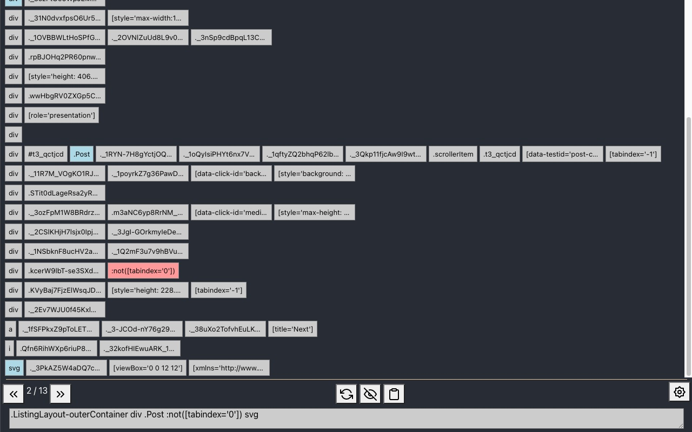

# CSS Selector Helper for Chrome

A Chrome DevTools extension that helps you build unique CSS selectors for web elements. Particularly useful for writing Selenium WebDriver tests or web scraping.



## Features

- **Element Hierarchy Display**: Shows all attributes (tag names, IDs, classes, and custom attributes) for the selected element and its ancestors
- **Interactive Selector Building**: Click attribute buttons to toggle them into your CSS selector
- **Negation Support**: Hold `Ctrl`, `Alt`, `Meta`, or `Shift` while clicking to add `:not()` selectors
- **Match Counter**: See how many elements match your current selector
- **Match Navigation**: Cycle through matching elements with prev/next buttons
- **Visibility Filter**: Toggle to show only visible elements (follows WebDriver visibility spec)
- **Copy to Clipboard**: One-click copy of the built selector
- **Theme Support**: Light, dark, and system theme modes
- **Customizable Filters**: Hide noisy attributes with regex-based filters

## Installation

### From Source

1. Clone this repository
2. Install dependencies:
   ```bash
   npm install
   ```
3. Build the extension:
   ```bash
   npm run build
   ```
4. Open Chrome and navigate to `chrome://extensions/`
5. Enable "Developer mode" (toggle in top right)
6. Click "Load unpacked" and select the `build` folder

### Development

To rebuild on file changes:
```bash
npm run watch
```

## Usage

1. Open Chrome DevTools (`F12` or `Cmd+Option+I`)
2. Navigate to the **Elements** panel
3. Find the **CSS Selector** sidebar pane (may need to expand the sidebar)
4. Select any element in the DOM tree
5. Click the **refresh** button to load attributes for the selected element
6. Click attribute buttons to build your selector
7. Use the **copy** button to copy the selector to clipboard

### Tips

- The selector displays at the bottom shows your current query
- Match count updates as you build the selector (e.g., "2 / 13" means match 2 of 13)
- Use the arrow buttons to navigate through matches and highlight them in the page
- Open settings (gear icon) to:
  - Toggle display of tag names, IDs, classes, or other attributes
  - Add custom regex filters to hide noisy attributes
  - Switch between light/dark themes

## Tech Stack

- React 17 + TypeScript
- Bootstrap 4 / React-Bootstrap
- Chrome Extensions Manifest V3
- Create React App (build tooling)

## License

MIT
